## Кирюхин Андрей, БПИ191

Домашнее задание ко второму семинару по Архитектуре вычислительных систем.
Все исходники находятся в папке 'code'

## 1 программа

Простым примером послужил Hello World код.

- **Код программы** 
  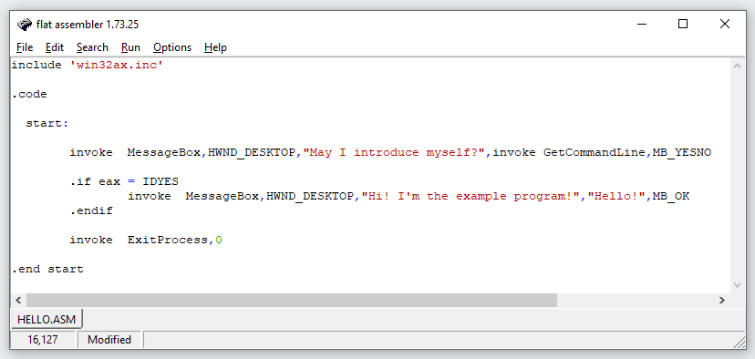 
  Как можно заметить программа создает диалоговое окно. Если нажать "Да", то будет запущена следующая часть программы, находящаяся внутри условного оператора.
- **Запуск программы** 
  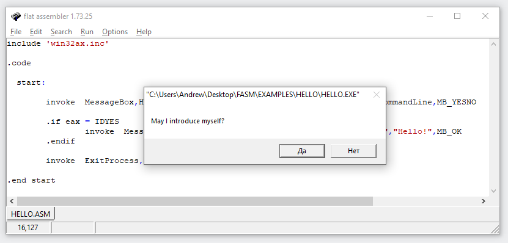 
- **Результат выполнения после нажатия "Да"** 
  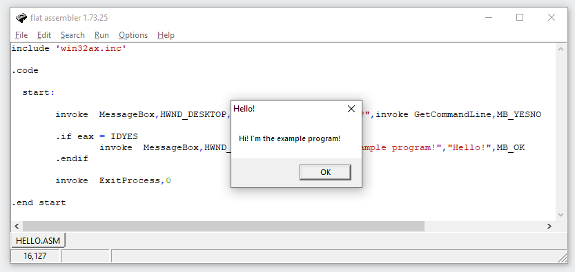 

---

## 2 программа

Следущая программа создает диалоговое окно с возможностью динамически изменять прозрачность окна с помощью ползунка.

- **Код программы (полный код можно найти в папке /code)** 
  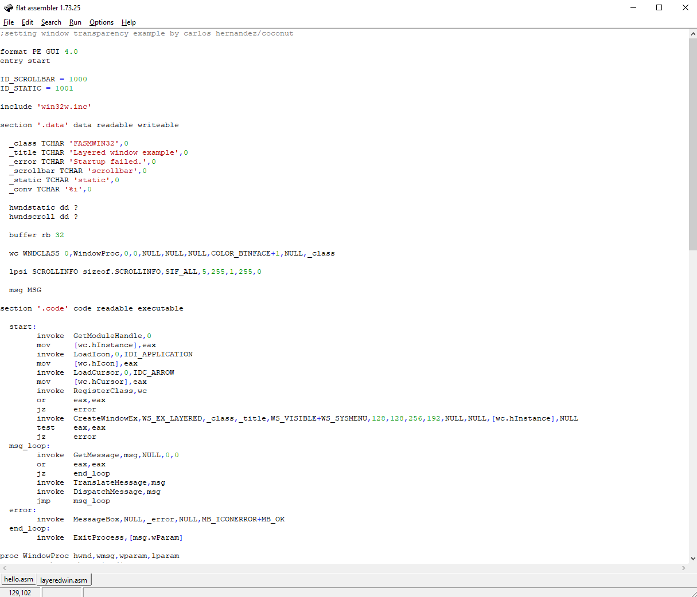 
  Как можно заметить программа создает диалоговое окно. Если нажать "Да", то будет запущена следующая часть программы, находящаяся внутри условного оператора.
- **Запуск программы** 
  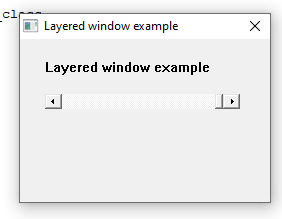 
- **Перемещение ползунка прозрачности** 
  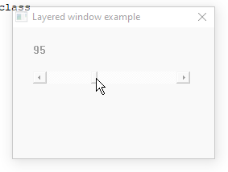 
  Попробуем немного изменить код.  
- **Изменим выделенное значение** 
  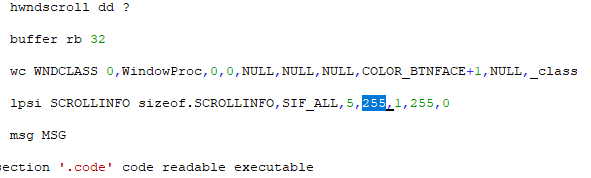 
- **Результат работы измененной программы** 
  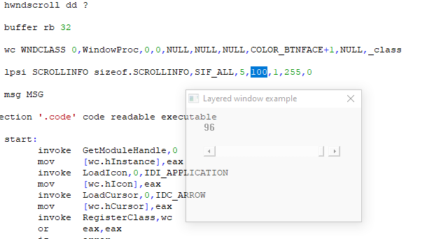 
  Как можно заметить, максимальное значение прозрачности изменилось до 100.

---

## 3 программа

Данная программа реализует функционал простого блокнота.

- **Код программы (полный код можно найти в папке /code)** 
  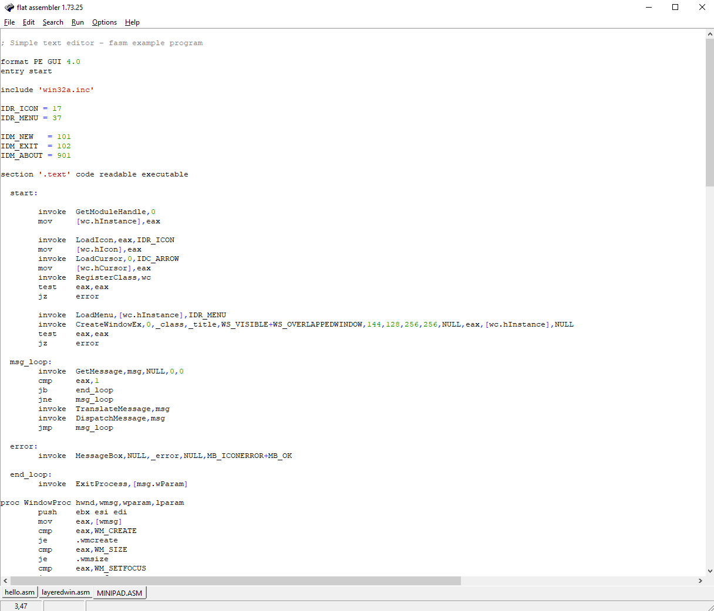 
- **Результат запуска программы** 
  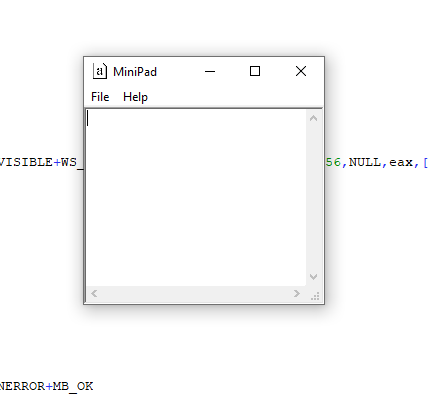 
  Читая код, можно заметить некоторые числа, которые видимо отвечают за размер окна, попробуем их изменить.
- **Изменение выделенных чисел** 
  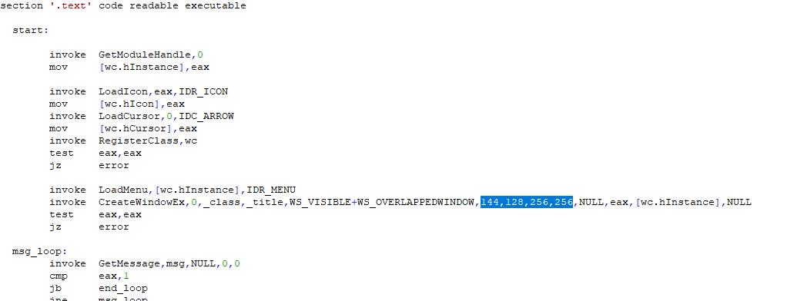 
- **Результат работы измененной программы** 
  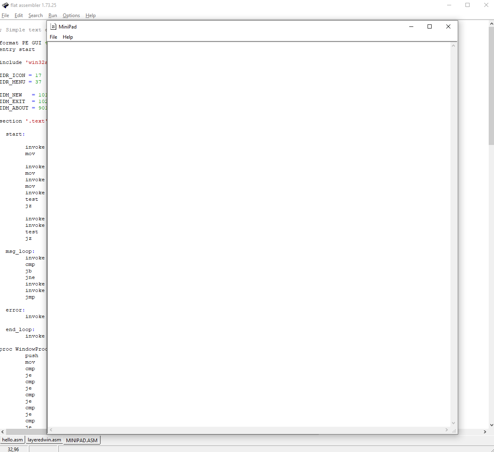 
  Как можно заметить, наше предположение было верным, получается первые два числа отвечают за координату X и Y, а вторые за длину и ширину.

---

## 4 программа

Перейдем к консольному интерфейсу. Данная программа просто выводит пользователю какое-то сообщение

- **Код программы** 
  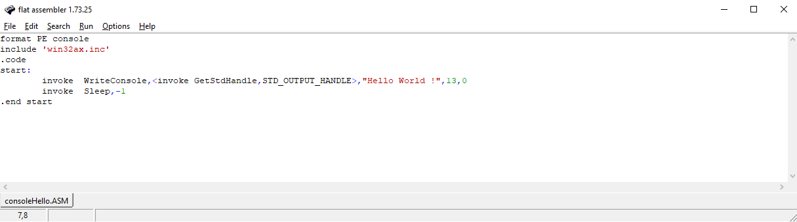 
- **Результат запуска программы** 
  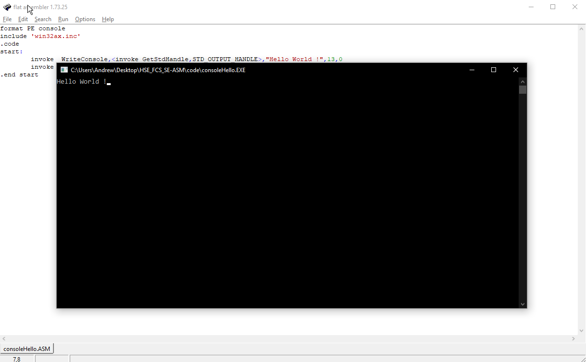 
  Текст может быть изменён на любой, главное изменить параметр длины строки.
- **Результат работы измененной программы** 
  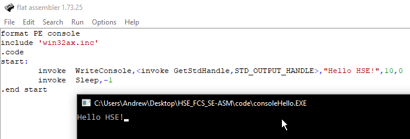 

---

## 5 программа

Рассмотрим пример поинтереснее. Данная программа в цикле считает сумму считанных чисел. После ввода нуля, цикл останавливается и выводится сумма.

- **Код программы** 
  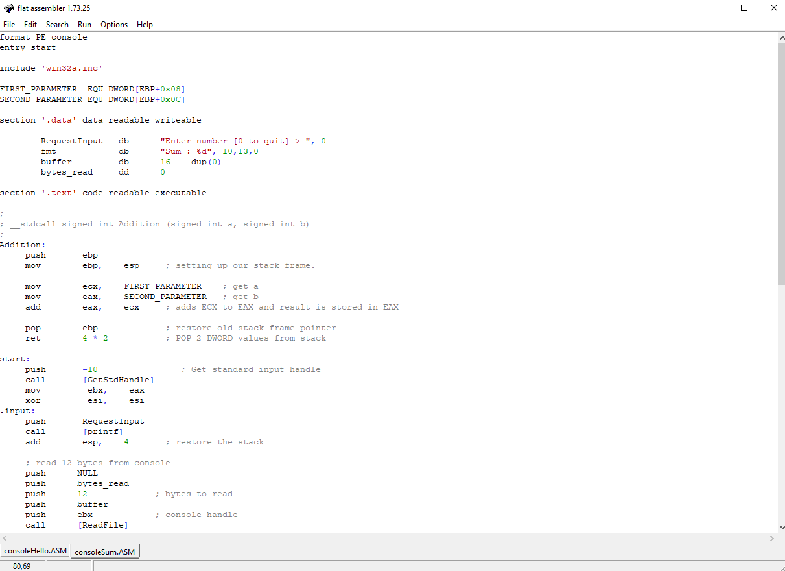 
- **Результат запуска программы** 
  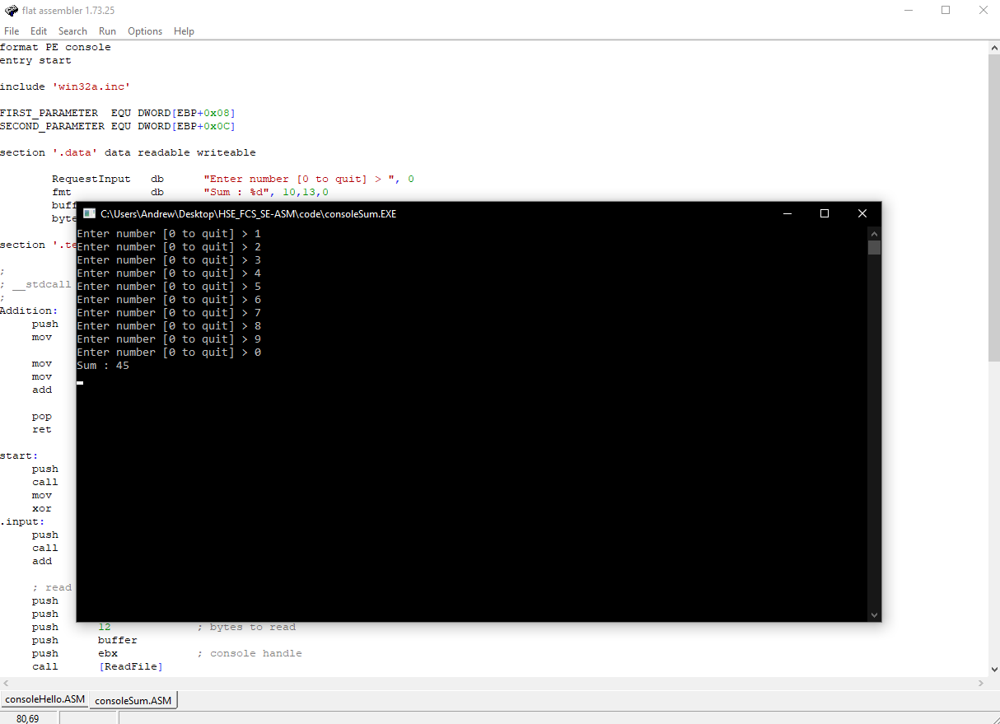 

  Теперь будем при каждом сложении добавлять 150 к результату.

- **Измененный код** 
  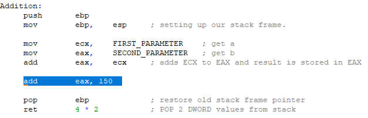 
  Проверим работу программы.

- **Результат работы измененной программы** 
  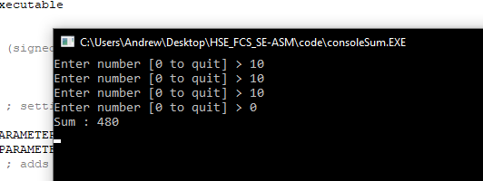 
  Получается 150 прибавилось 3 раза, после ввода 0, программа завершила свою работу и вывела результат.
