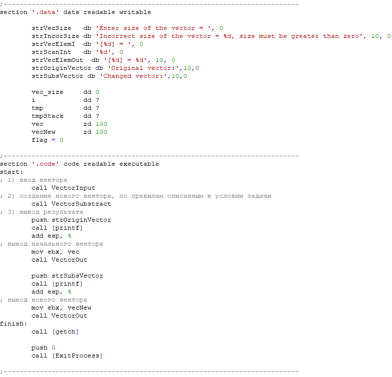
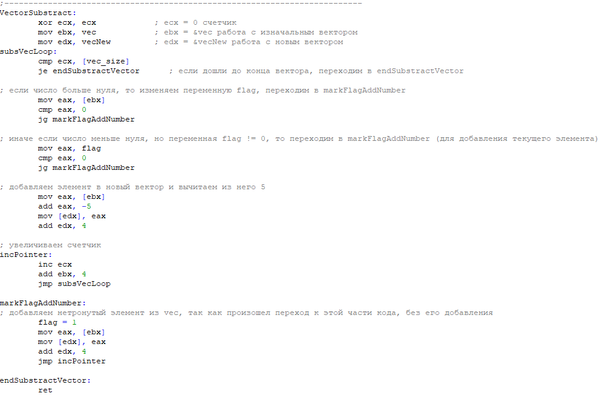
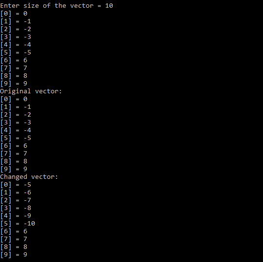
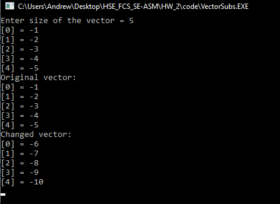
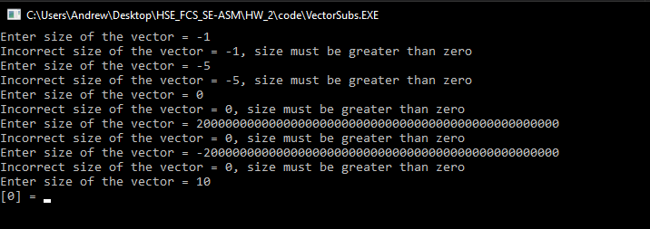
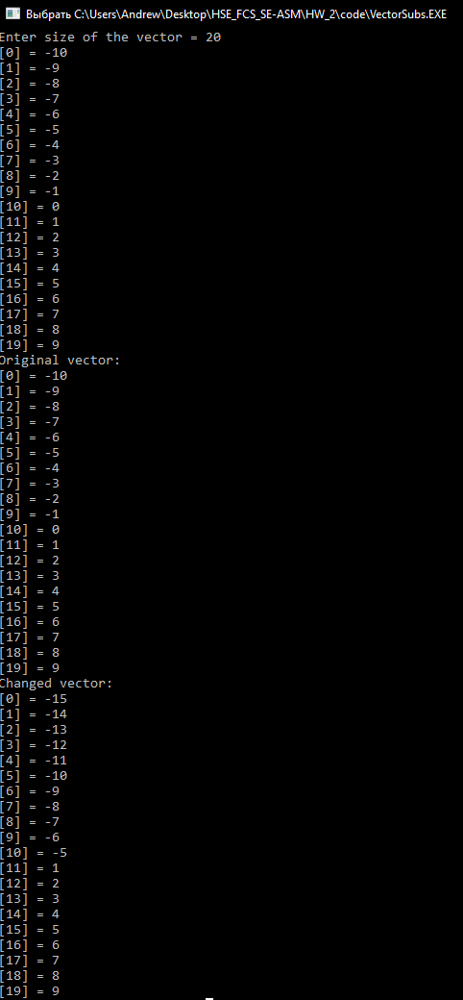
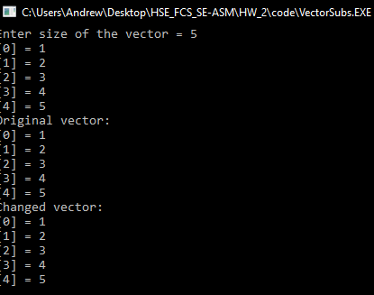

## Кирюхин Андрей, БПИ191

Второе домащнее задание по Архитектуре вычислительных систем. Вариант 18.
Исходники находятся в папке code.

---

## Выполнение задания

#### Условие:

Разработать программу, которая вводит одномерный массив A[N], формирует из элементов массива A новый массив B с уменьшением всех элементов до первого положительного на 5.

#### Разработка:

За основу был взят код, представленый на сайте [softcraft.ru](http://softcraft.ru/edu/comparch/practice/asm86/03-subprog/)

- **Объявление данных и основная часть программы** 
   
  В секцию с данными были добавлены новые переменные, для удобного вывода, а также для корректной работы программы: 
  - **flag** - флаг необходим для того, чтобы программа перестала вычитать 5 из неположительных элементов после первого положительного.
  - **vecNew** - хранение нового полученного вектора, т.к. в условии задачи необходимо именно _создать_ новый массив, а не изменить изначальный.
  - **str\*** - добавлены некоторые строки для удобного вывода результатов работы программы.  

По процедурам, указанным в секции **.code** программу можно разделить на следующие части:

1. Ввод вектора
2. Создание нового вектора, в котором все элементы уменьшены на 5, до первого положительного
3. Вывод векторов (начального и нового)

Рассмотрим процедуру создания нового вектора, так как она была написана с нуля, тогда как ввод и вывод векторов подверглись не таким ззначительным изменениям (все исходники доступны в папке code)

---

**Процедура создания нового измененного вектора** 
 

Пока программа считывает неположительные числа, то они уменьшаются на 5 и добавляеются в **vecNew**. Когда появлятся первое положительное число, то переменная **flag** становится равна **1**. Таким образом, все остальные элементы не будут уменьшены, а просто добавлены в новый массив. 
Более конкретная логика работы отображена в комментариях в коде на скриншоте выше.

---

## Тестирование программы

В данном блоке проведен ряд тестов программы.

- **Тестирование на простом массиве (10 элементов)** 
   
  Был получен правильный новый массив  
- **Тестирование на массиве, состоящего только из неположительных элементов (5 элементов)** 
   
  Был получен правильный новый массив 
- **Попытка ввести неположительный, а также очень большой размер вектора** 
   
  Программа отработала корректно 
- **Тестирование на простом среднем массиве (20 элементов)** 
   
  Был получен правильный новый массив  
- **Тестирование на массиве, состоящего только из положительных элементов (5 элементов)** 
   
  Как можно заметить, вектор не изменился, что по условию задачи, является правильным выводом программы 

---

Таким образом была успешно разработана и протестирована данная программа.
