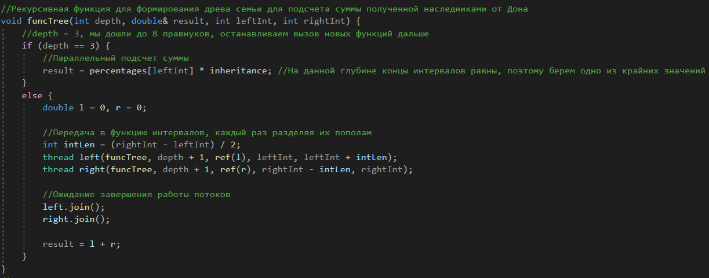
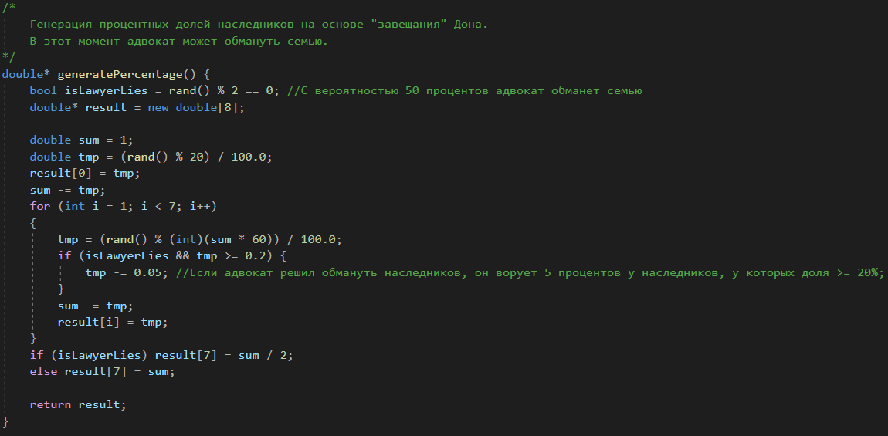
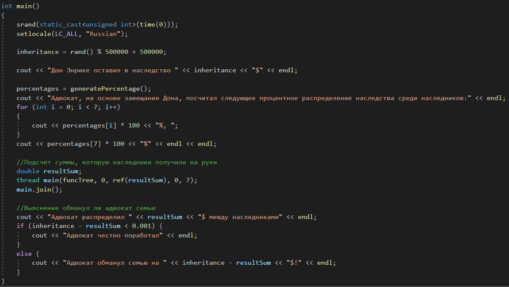
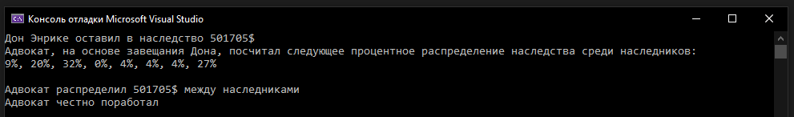
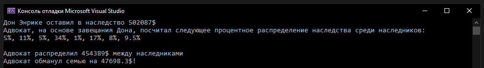

## Кирюхин Андрей, БПИ191

Третье домашнее задание по Архитектуре вычислительных систем. Вариант 18.
Исходники находятся в папке code.

---

## Выполнение задания

#### Условие:

Задача о наследстве. У старого дона Энрике было два сына, у каждого из сыновей – еще по два сына, каждый из которых имел еще по два сына. Умирая, дон Энрике завещал все свое богатство правнукам в разных долях. Адвокат дон Хосе выполнил задачу дележа наследства в меру своих способностей. Правнуки заподозрили адвоката в укрывательстве части наследства. Требуется создать многопоточное приложение, которое при известных сумме завещания дона Энрике и доле каждого наследника, проверяет честность адвоката. При решении использовать принцип дихотомии.

#### Разработка:

Для решения была выбрана следующая модель построения многопоточных приложений: **Рекурсивный параллелизм**(_используется в программах с одной или несколькими рекурсивными процедурами, вызов которых независим. Это технология «разделяй-и-властвуй» или «перебор-с-возвратами»._)  
После консультации с преподавателем, было решено генерировать доли наследников и размер наследства случайно внутри программы (в условии не было четких требований касательно этого).

- **Основная рекурсивная функция** 
   
  В **main** в отдельном потоке запускается данная функция с параметрами _leftInt_ = 0, _rightInt_ = 7 (крайние значения индексов в массиве долей наследников). 
  Затем интервал делится на два и от них уже вызываются два раза данная рекурсивная функция. Такое деление происходит пока глубина рекурсии не равна трём, затем для каждого наследника считается полученная сумма и передается в родительскую функцию (так происходит для всех узлов). В итоге в первой вызванной рекурсивной функции (с параметрами 0,7) будет значение общей суммы, которую получили наследники.  
- **Функция генерации долей наследников** 
   
- **Точка входа в программу** 
   

---

## Тестирование программы

В данном блоке проведен ряд тестов программы. И так как все параметры (размер наследства, доли) генерируются случайно внутри программы, то продемонстрирую работоспособность программы при разных сценариях.

- **Адвокат не обманул семью** 
   

- **Адвокат обманул семью** 
   

---

Таким образом была успешно разработана и протестирована данная программа.
