## Кирюхин Андрей, БПИ191

Домашнее задание ко второму семинару по Архитектуре вычислительных систем.
Все исходники находятся в папке 'code'

## 1 программа

Простым примером послужил Hello World код.

- **Код программы**\
  \
  Как можно заметить программа создает диалоговое окно. Если нажать "Да", то будет запущена следующая часть программы, находящаяся внутри условного оператора.
- **Запуск программы**\
  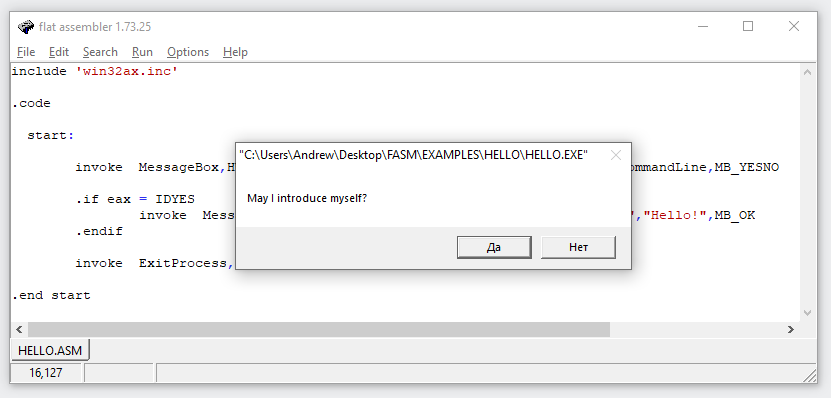\
- **Результат выполнения после нажатия "Да"**\
  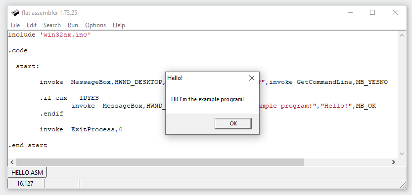\

---

## 2 программа

Следущая программа создает диалоговое окно с возможностью динамически изменять прозрачность окна с помощью ползунка.

- **Код программы (полный код можно найти в папке /code)**\
  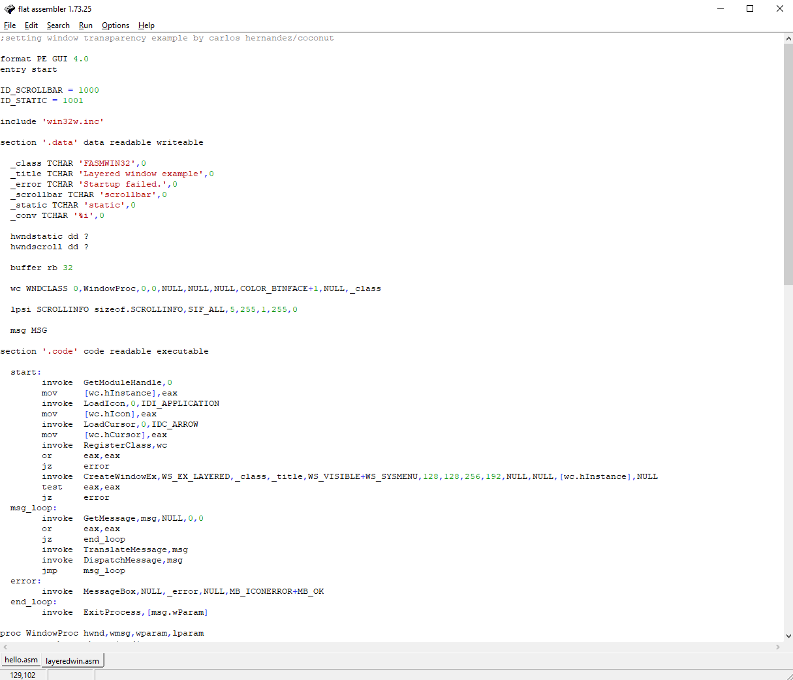\
  Как можно заметить программа создает диалоговое окно. Если нажать "Да", то будет запущена следующая часть программы, находящаяся внутри условного оператора.
- **Запуск программы**\
  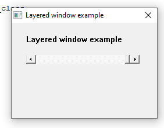\
- **Перемещение ползунка прозрачности**\
  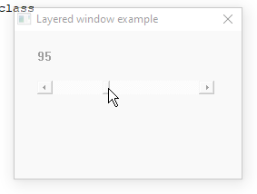\
  Попробуем немного изменить код. \
- **Изменим выделенное значение**\
  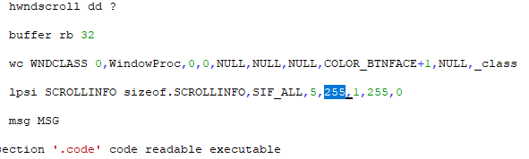\
- **Результат работы измененной программы**\
  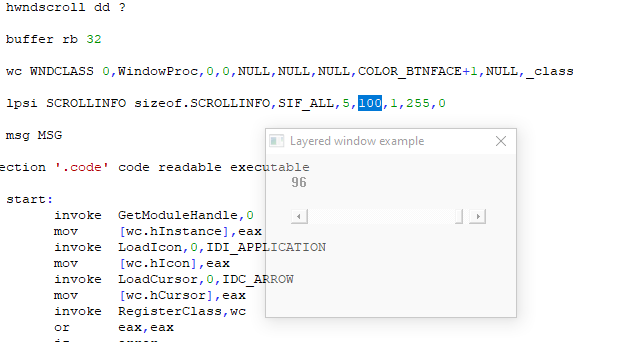\
  Как можно заметить, максимальное значение прозрачности изменилось до 100.

---

## 3 программа

Данная программа реализует функционал простого блокнота.

- **Код программы (полный код можно найти в папке /code)**\
  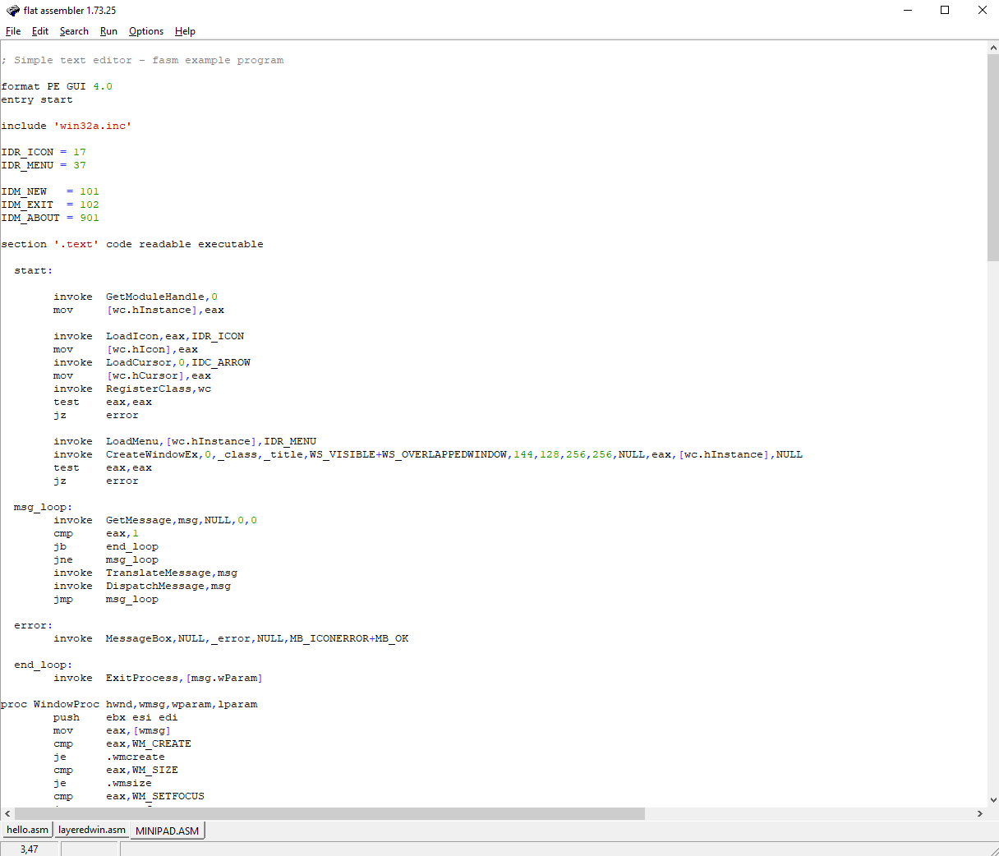
- **Результат запуска программы**\
  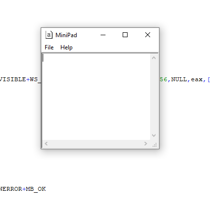\
  Читая код, можно заметить некоторые числа, которые видимо отвечают за размер окна, попробуем их изменить.
- **Изменение выделенных чисел**\
  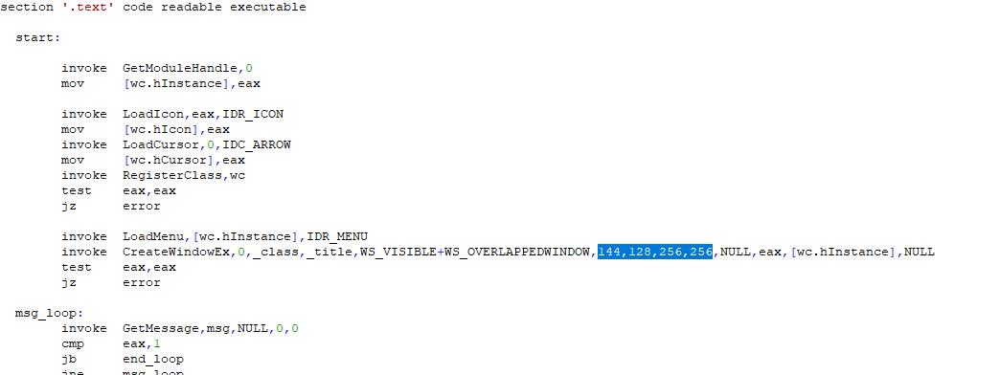\
- **Результат работы измененной программы**\
  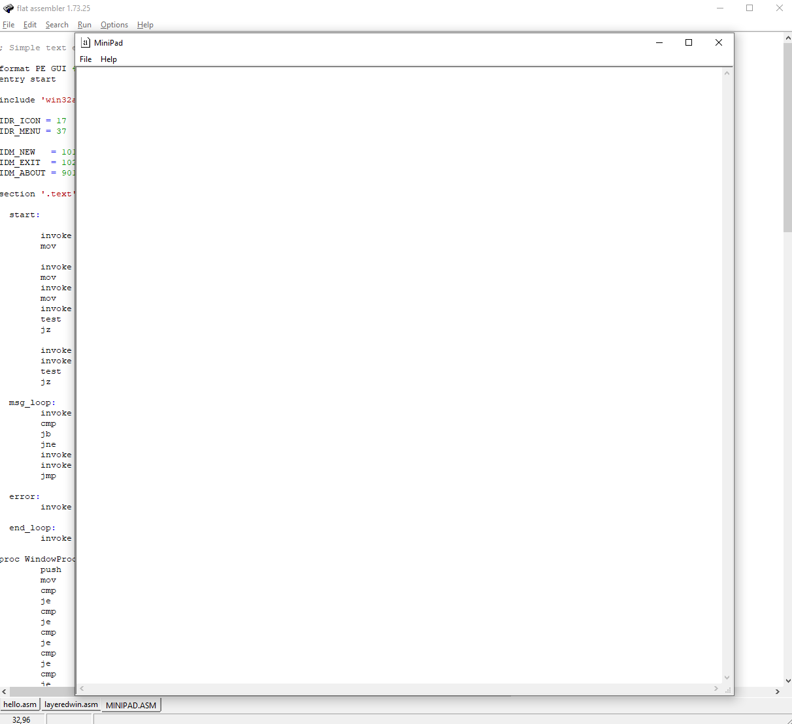\
  Как можно заметить, наше предположение было верным, получается первые два числа отвечают за координату X и Y, а вторые за длину и ширину.
