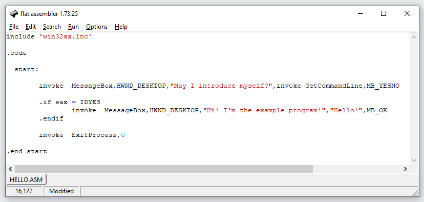

## Кирюхин Андрей, БПИ191

Домашнее задание ко второму семинару по Архитектуре вычислительных систем.
Все исходники находятся в папке 'code'

## 1 программа

Простым примером послужил Hello World код.

- **Код программы**
  

---

- ***
  
